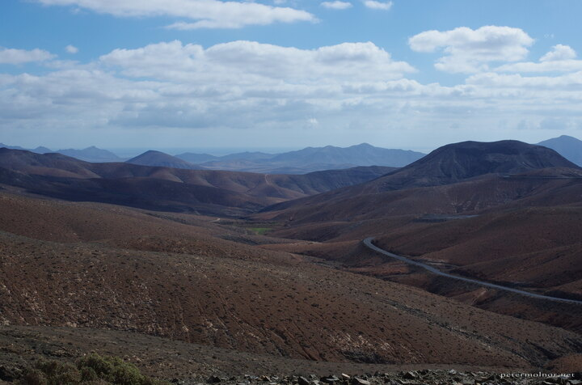

---
author:
    email: mail@petermolnar.net
    image: https://petermolnar.net/favicon.jpg
    name: Peter Molnar
    url: https://petermolnar.net
copies:
- https://www.flickr.com/photos/36003160@N08/24418940997
- http://web.archive.org/web/20190624125840/https://petermolnar.net/mountains-of-fuerteventura/
published: '2017-12-24T08:00:00+00:00'
syndicate:
- https://brid.gy/publish/flickr
tags:
- Canary Islands
- Fuerteventura
title: Mountains of Fuerteventura

---

There is a rather empty road on Fuerteventura, the one that goes through
Betancuria, in the mountains, to the south, FV-30. I can certainly
recommend taking this route if you can: it's calm, outerworldly, with
ravens visiting you at the miradors, showing all the beautiful mountains
on the west side of the island.