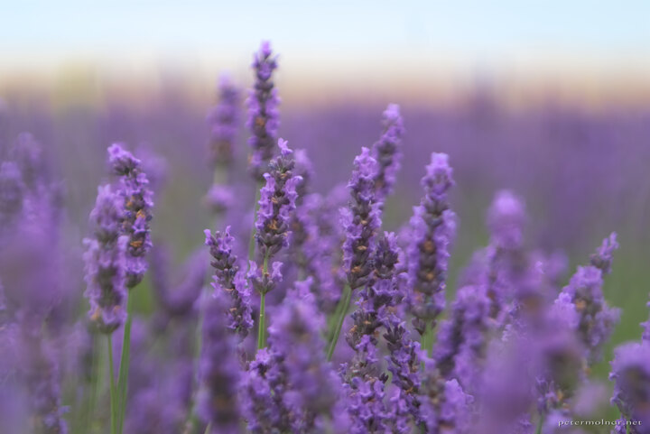

---
author:
    email: mail@petermolnar.net
    image: https://petermolnar.net/favicon.jpg
    name: Peter Molnar
    url: https://petermolnar.net
coordinates:
    latitude: 52.907064
    longitude: 0.504469
copies:
- https://www.flickr.com/photos/36003160@N08/15010322297
- http://web.archive.org/web/20141014082241/https://petermolnar.eu/photo/norfolk-lavender-late-lavender/
published: '2014-09-10T09:00:09+00:00'
syndicate:
- https://brid.gy/publish/flickr
tags:
- lavender
- lavender field
- sunset
- Norfolk
title: Norfolk Lavender - Late Lavender

---

We reached the Norfolk lavender fields just before sunset, which gave us
nice gradient backgrounds. If you ever plan to visit the lavender
fields, do it in July; that is the time when they are the most
beautiful.