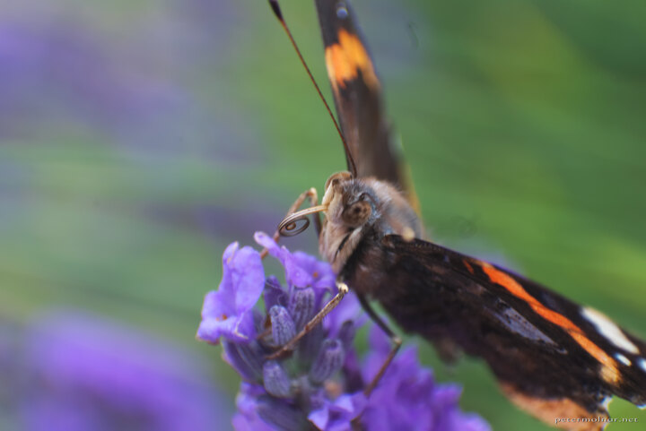

---
author:
    email: mail@petermolnar.net
    image: https://petermolnar.net/favicon.jpg
    name: Peter Molnar
    url: https://petermolnar.net
coordinates:
    latitude: 52.90806
    longitude: 0.503911
copies:
- https://www.flickr.com/photos/36003160@N08/15164216316
- http://web.archive.org/web/20141013232201/https://petermolnar.eu/photo/norfolk-lavender-tortile-tongue/
published: '2014-09-09T09:00:10+00:00'
syndicate:
- https://brid.gy/publish/flickr
tags:
- United Kingdom
- lavender
- butterfly
- Red Admiral butterfly
- Norfolk
title: Norfolk Lavender - Tortile Tongue

---

Red Admiral butterfly feeding on Norfolk lavender. Slow and calm,
probably due to being soothened by the lavender :)