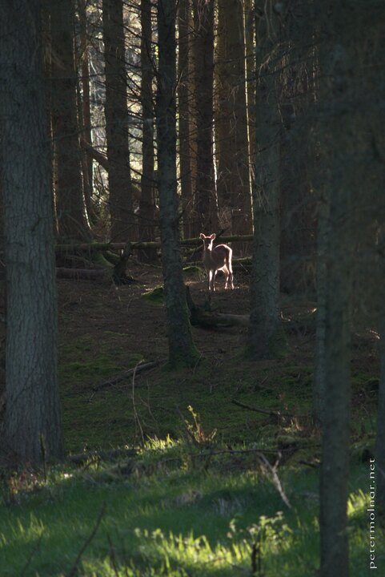

---
author:
    email: mail@petermolnar.net
    image: https://petermolnar.net/favicon.jpg
    name: Peter Molnar
    url: https://petermolnar.net
copies:
- https://www.flickr.com/photos/36003160@N08/14564912217
- http://web.archive.org/web/20190624125903/https://petermolnar.net/northern-ireland-miraculous-stag/
published: '2014-07-26T20:00:29+00:00'
syndicate:
- https://brid.gy/publish/flickr
tags:
- Ballypatrick Forest
- stag
- forest
- Northern Ireland
- twilight
- ligths
title: Northern Ireland - Miraculous stag

---

We were heading back from the magnificient Antrim Coast through the very
distant feeling Glens and stopped for a little rest in Ballypatrick
Forest.

Soon after we started walking, we spotted a stag, right in the last
lights of the sun. It was kind enought to wait till I put on the tele
lens to photograph.