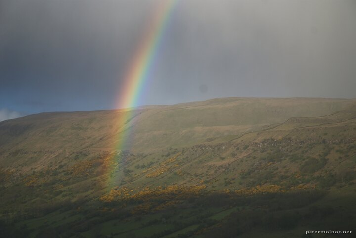

---
author:
    email: mail@petermolnar.net
    image: https://petermolnar.net/favicon.jpg
    name: Peter Molnar
    url: https://petermolnar.net
copies:
- https://www.flickr.com/photos/36003160@N08/14760240755
- http://web.archive.org/web/20190624125904/https://petermolnar.net/northern-ireland-shadow-of-a-rainbow/
published: '2014-07-27T20:00:30+00:00'
syndicate:
- https://brid.gy/publish/flickr
tags:
- Northern Ireland
- leprechaun
- shadow
title: Northern Ireland - shadow of a rainbow

---

Norther Ireland is strange, especially when in comes to rainbows. We
were on the road, right after a strong rain and soon after we saw this
scene. The shadow is from the mountain that was right behind us, but is
perfectly met the end of the rainbow.