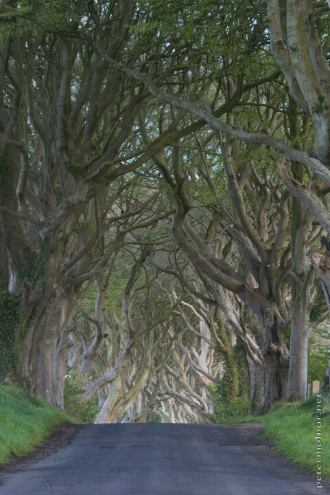

---
author:
    email: mail@petermolnar.net
    image: https://petermolnar.net/favicon.jpg
    name: Peter Molnar
    url: https://petermolnar.net
coordinates:
    latitude: 55.135886
    longitude: -6.383185
copies:
- https://www.flickr.com/photos/36003160@N08/14557469857
- http://web.archive.org/web/20190624125906/https://petermolnar.net/northern-ireland-the-dark-hedges/
published: '2014-07-25T20:00:25+00:00'
syndicate:
- https://brid.gy/publish/flickr
tags:
- Northern Ireland
- The Dark Hedges
- trees
- hedges
title: Northern Ireland - The Dark Hedges

---

Long before this place was "featured" on Game of Thrones, we spotted
this place with the help of the images in Google Maps.

We already had an approximate plan what to see and visit in Northern
Ireland when we were planning our trip when an image of the Dark Hedges
popped up.

Finding the actual road is a bit tricky; it's in a rural, fairly
abandoned area and even the locals might not know where it is.

Unfortunately they set up a bright, ugly, rudely intrusive fence on one
side and it's very hard to find a spot where it's not too harsh on the
picture. Everyone was against the fence, yet it was still put in place;
I hope it will go away soon.

Don't forget to stay till sunset: you might spot the wandering grey lady
ghost who is spotted here occasionally.