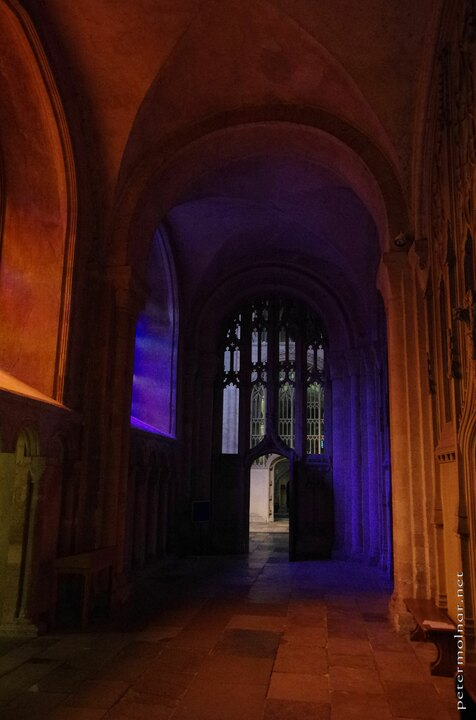

---
author:
    email: mail@petermolnar.net
    image: https://petermolnar.net/favicon.jpg
    name: Peter Molnar
    url: https://petermolnar.net
coordinates:
    latitude: 52.6320990001417
    longitude: 1.301504
copies:
- https://www.flickr.com/photos/36003160@N08/18336529105
- http://web.archive.org/web/20190624125909/https://petermolnar.net/norwich-cathedral-passage/
published: '2015-06-01T07:19:21+00:00'
syndicate:
- https://brid.gy/publish/flickr
tags:
- church
- purple
- colors
- lights
- cathedral
- colours
- orange
title: Norwich Cathedral Passage

---

The Norwich Cathedral has some very modern, very strange stained glass
at the end of the left corridor which renders the area orange and purple
during the afternoon.