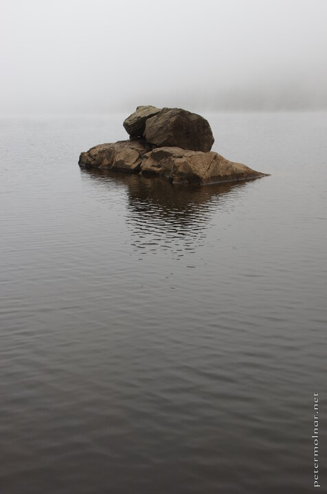

---
author:
    email: mail@petermolnar.net
    image: https://petermolnar.net/favicon.jpg
    name: Peter Molnar
    url: https://petermolnar.net
coordinates:
    latitude: 54.511067
    longitude: -3.049156
copies:
- https://www.flickr.com/photos/36003160@N08/21539524913
- http://web.archive.org/web/20190624125915/https://petermolnar.net/not-that-cliche/
published: '2015-10-14T10:07:28+00:00'
syndicate:
- https://brid.gy/publish/flickr
tags:
- chill
- peace
- autumn
- lake
- still
- water
- calm
- stone
title: Not that cliche

---

There are photographic clichés - there always were photographic clichés,
and even if you try to avoid them, sometimes you just flow with it,
because there is a reason for their existence: generally, they are nice
to see.

In this case there was one single element I could add to avoid some of
the copy factor: not doing long exposure. I wanted to keep the texture
of the water, because this is what I saw; not a milky, cloudy effect.
That was in the background, provided by the mist.

Don't be afraid to take "classic" or overused scenes, but do try to
alter them, to make them unique enough.