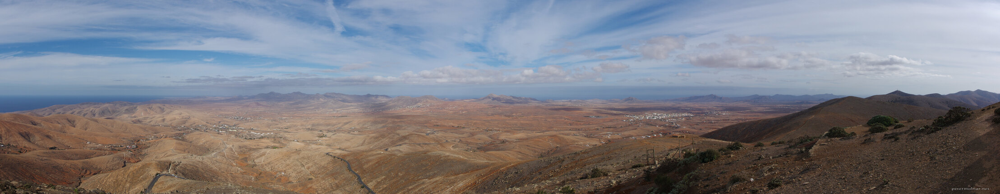

---
author:
    email: mail@petermolnar.net
    image: https://petermolnar.net/favicon.jpg
    name: Peter Molnar
    url: https://petermolnar.net
copies:
- https://www.flickr.com/photos/36003160@N08/25314240808
- http://web.archive.org/web/20190624125929/https://petermolnar.net/panorama-from-mirador-de-morro-velosa/
published: '2017-12-20T08:00:00+00:00'
syndicate:
- https://brid.gy/publish/flickr
tags:
- Canary Islands
- Fuerteventura
title: Panorama from Mirador De Morro Velosa

---

When visiting a mirador, one might expect a place to buy coffee next to
a magnificent view, but Mirador De Morro Velosa offers a lot more.
Besides the panoramic view, the building also functions as a museum
about the islands and their origins - and yes, you can still get a
Cortado leche v leche.

Since my camera doesn't have a panorama function, I had to improvise: 4
handheld shoots combined perfectly with Hugin turned out better, than I
expected.