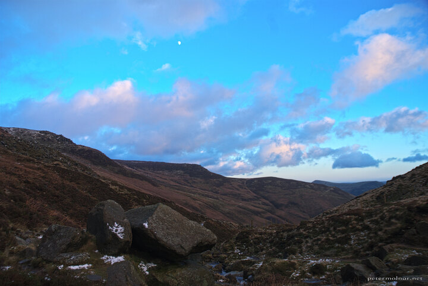

---
author:
    email: mail@petermolnar.net
    image: https://petermolnar.net/favicon.jpg
    name: Peter Molnar
    url: https://petermolnar.net
coordinates:
    latitude: 53.388805
    longitude: -1.833515
copies:
- https://www.flickr.com/photos/36003160@N08/14834469312
- http://web.archive.org/web/20140919143446/https://petermolnar.eu/photo/peak-district-in-the-winter-daylight-with-the-moon/
published: '2014-08-05T10:03:31+00:00'
syndicate:
- https://brid.gy/publish/flickr
tags:
- landscape
- Peak District
- winter
title: Peak District in the winter - daylight with the Moon

---

Still bright, blue sky above the peaks could even be called a common
view - but not with the Moon shining bright already.