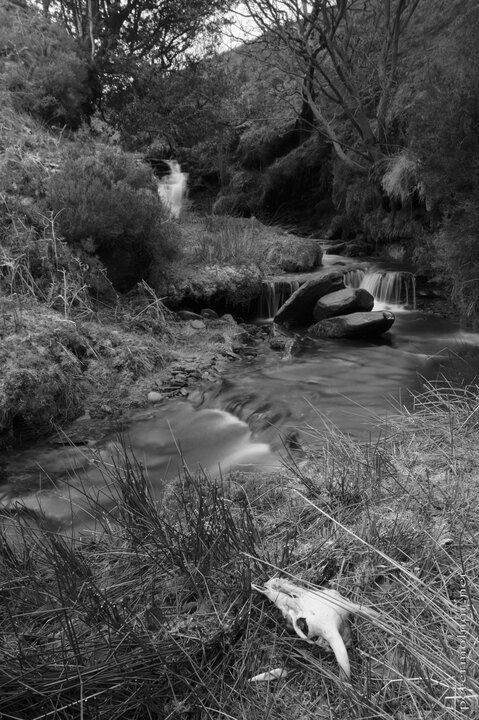

---
author:
    email: mail@petermolnar.net
    image: https://petermolnar.net/favicon.jpg
    name: Peter Molnar
    url: https://petermolnar.net
coordinates:
    latitude: 53.393873
    longitude: -1.820125
copies:
- https://www.flickr.com/photos/36003160@N08/15164450992
- http://web.archive.org/web/20190624125934/https://petermolnar.net/peak-district-in-the-winter-skull/
published: '2014-09-07T09:00:04+00:00'
syndicate:
- https://brid.gy/publish/flickr
tags:
- dead
- winter
- Peak District
- death
- skull
- waterfall
title: Peak District in the winter - skull

---

Originally we wanted to take a photo of the waterfall in the background
and only spotted the white skull when we reached it very close.