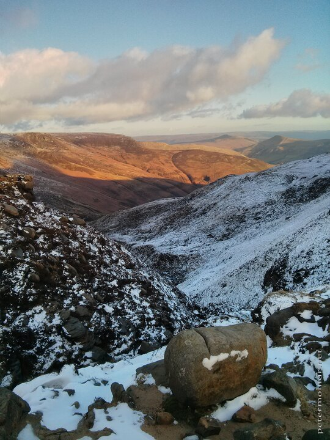

---
author:
    email: mail@petermolnar.net
    image: https://petermolnar.net/favicon.jpg
    name: Peter Molnar
    url: https://petermolnar.net
coordinates:
    latitude: 53.37575
    longitude: -1.822357
copies:
- https://www.flickr.com/photos/36003160@N08/14861899833
- http://web.archive.org/web/20150531180101/https://petermolnar.eu/photo/peak-district-in-the-winter-sunset-scenery/
published: '2014-08-06T06:30:54+00:00'
syndicate:
- https://brid.gy/publish/flickr
tags:
- landscape
- Peak District
- winter
title: Peak District in the winter - sunset scenery

---

Watching the sunset from the top of a hill is always beautiful, until
you realize, you'll need to get down in the dark.

But is was definitely worth it.