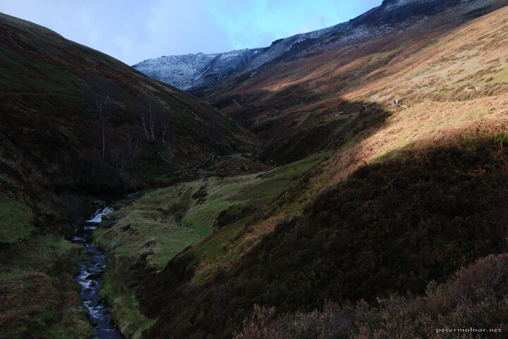

---
author:
    email: mail@petermolnar.net
    image: https://petermolnar.net/favicon.jpg
    name: Peter Molnar
    url: https://petermolnar.net
coordinates:
    latitude: 53.387474
    longitude: -1.826391
copies:
- https://www.flickr.com/photos/36003160@N08/14834345806
- http://web.archive.org/web/20140920033511/https://petermolnar.eu/photo/peak-district-in-the-winter-valley-2/
published: '2014-08-08T06:30:55+00:00'
syndicate:
- https://brid.gy/publish/flickr
tags:
- landscape
- Peak District
- winter
title: Peak District in the winter - valley

---

The Peak District is about what it's name states: peaks. During the
winter, it's nearly abandoned, with only a few enthusiasts out there,
it's quiet, peaceful and beautiful.