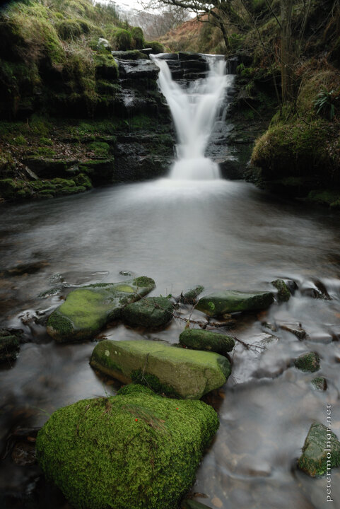

---
author:
    email: mail@petermolnar.net
    image: https://petermolnar.net/favicon.jpg
    name: Peter Molnar
    url: https://petermolnar.net
coordinates:
    latitude: 53.392491
    longitude: -1.831197
copies:
- https://www.flickr.com/photos/36003160@N08/14967956898
- http://web.archive.org/web/20141013052645/https://petermolnar.eu/photo/peak-district-in-the-winter-waterfall/
published: '2014-09-06T09:00:03+00:00'
syndicate:
- https://brid.gy/publish/flickr
tags:
- stream
- water
- Peak District
- waterfall
- winter
title: Peak District in the winter - waterfall

---

We spotted the waterfall from the tourist path way above; the slope was
surprisingly steep downhills, but the view was worth it.