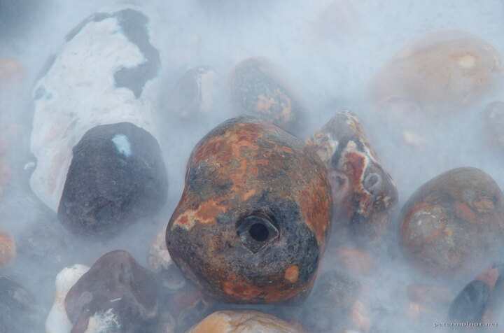

---
author:
    email: mail@petermolnar.net
    image: https://petermolnar.net/favicon.jpg
    name: Peter Molnar
    url: https://petermolnar.net
coordinates:
    latitude: 50.758555
    longitude: 0.150022
copies:
- https://www.flickr.com/photos/36003160@N08/17304047196
- http://web.archive.org/web/20150529121055/https://petermolnar.eu/photo/pebbles/
published: '2015-05-01T06:02:51+00:00'
syndicate:
- https://brid.gy/publish/flickr
tags:
- sea
- pebble
- stones
- long exposure
- Seven Sisters
title: Pebbles

---

Sea-washed pebbles on the shore of the Seven Sisters