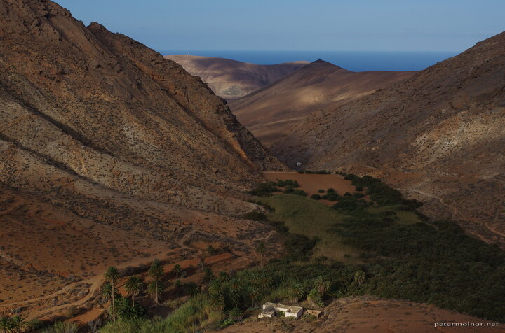

---
author:
    email: mail@petermolnar.net
    image: https://petermolnar.net/favicon.jpg
    name: Peter Molnar
    url: https://petermolnar.net
copies:
- https://www.flickr.com/photos/36003160@N08/38404494375
- http://web.archive.org/web/20190624125940/https://petermolnar.net/penitas-dam/
published: '2017-12-23T08:00:00+00:00'
syndicate:
- https://brid.gy/publish/flickr
tags:
- Canary Islands
- Fuerteventura
title: Peñitas Dam

---

During the past centuries there were numerous attempts to make
Fuerteventura greener again - one of them was the Peñitas Dam.
Unfortunately the erosion of the surrounding mountains is too strong,
pushing a lot of soil into the dam, making the water completely
disappear in the mud. It still contains a lot of water though, given how
happy the trees are in the valley - trees, which are already rare at
Fuerteventura.

(Also: a small praise for my Pentax camera, for producing an image like
this, ouf of the machine without post-processing or filters.)