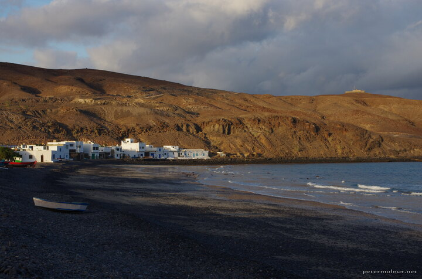

---
author:
    email: mail@petermolnar.net
    image: https://petermolnar.net/favicon.jpg
    name: Peter Molnar
    url: https://petermolnar.net
copies:
- https://www.flickr.com/photos/36003160@N08/38404497655
- http://web.archive.org/web/20190624125952/https://petermolnar.net/pozo-negro/
published: '2017-12-25T08:00:00+00:00'
syndicate:
- https://brid.gy/publish/flickr
tags:
- Canary Islands
- Fuerteventura
- sea
- ocean
- shore
- seashore
title: Pozo Negro

---

Pozo Negro got about 2 sentences in the guide book for Fuerteventura,
and most of those 2 lines was that it has 2 pescados, fish restaurants.
Well, it did, in fact had nice fish, and if you're there by sunset, like
we were, it also offers beautiful colours.