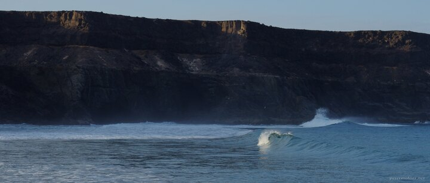

---
author:
    email: mail@petermolnar.net
    image: https://petermolnar.net/favicon.jpg
    name: Peter Molnar
    url: https://petermolnar.net
copies:
- https://www.flickr.com/photos/36003160@N08/27551678499
- http://web.archive.org/web/20190624125959/https://petermolnar.net/puertito-de-los-molinos/
published: '2017-12-27T08:00:00+00:00'
syndicate:
- https://brid.gy/publish/flickr
tags:
- Canary Islands
- Fuerteventura
- sea
- ocean
- shore
- seashore
title: Puertito de los Molinos

---

Puertito de los Molinos has huge, steep, beautiful walls of rock
surrounding it; unfortunately it's more or less impossible to climb down
on them. We planned to get here by sunset, but it was pitch black when
we actually arrived, so instead before getting our flight home, we got
up early and came back for sunrise. It was worth it: when sunrise comes
with the high tide the waves are magnificent, even with a calm weather.