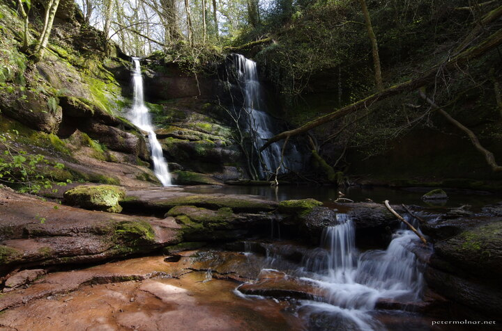

---
author:
    email: mail@petermolnar.net
    image: https://petermolnar.net/favicon.jpg
    name: Peter Molnar
    url: https://petermolnar.net
copies:
- https://www.flickr.com/photos/36003160@N08/51163453038
- http://web.archive.org/web/20210507114325/https://petermolnar.net/photo/pwll-y-wrach-waterfall/
published: '2021-05-07T09:00:00+01:00'
title: Pwll-y-wrach Waterfalls

---

This was finally a real waterfall; the previous one I visited this day
turned out to be a tiny stream in the middle of nowhere. Pwll-y-wrach is
a small nature reserve, quite easy to climb and have a nice walk, even
with family.