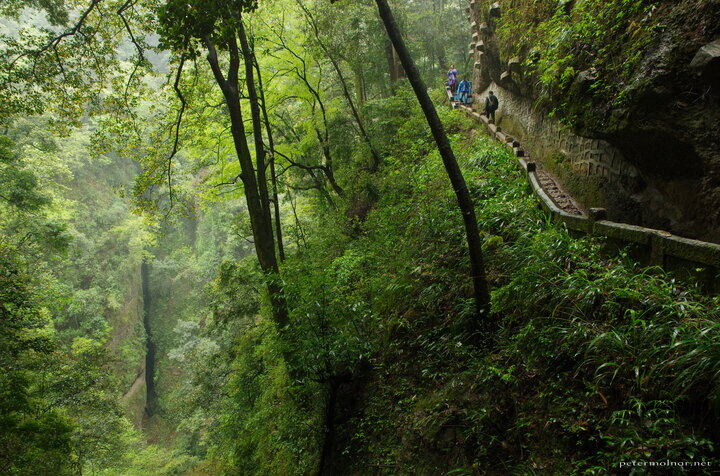

---
author:
    email: mail@petermolnar.net
    image: https://petermolnar.net/favicon.jpg
    name: Peter Molnar
    url: https://petermolnar.net
coordinates:
    latitude: 30.904912
    longitude: 103.566012
copies:
- https://www.flickr.com/photos/36003160@N08/27058891471
- http://web.archive.org/web/20160709135314/https://petermolnar.eu/qingcheng-gulch/
published: '2016-05-20T10:00:49+00:00'
syndicate:
- https://brid.gy/publish/flickr
tags:
- People's Republic of China
- Sichuan
- gulch
- forest
- creek
- mountain
- nature
- China
- Mount Qingcheng
title: Qingcheng gulch

---

I was expecting many nice temples and carefully maintained steps on the
front side of Mount Qincheng, but not hundred meter deep gulch; and
while I prefer to shoot images like this without people on it, in this
case, to show the real sizes.