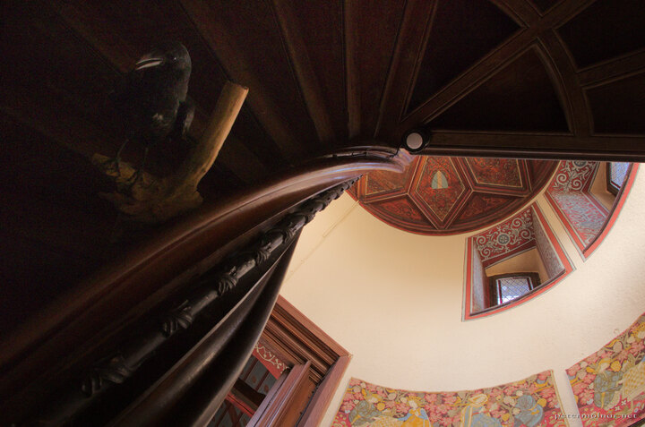

---
author:
    email: mail@petermolnar.net
    image: https://petermolnar.net/favicon.jpg
    name: Peter Molnar
    url: https://petermolnar.net
coordinates:
    latitude: 50.142194
    longitude: 7.167034
copies:
- https://www.flickr.com/photos/36003160@N08/25245418626
- http://web.archive.org/web/20190624130010/https://petermolnar.net/raven-of-the-stairs/
published: '2016-02-26T10:00:17+00:00'
syndicate:
- https://brid.gy/publish/flickr
tags:
- Germany
- contrast
- castle
- medieval
- raven
- pettern
- Cochem
- window
- stairs
title: Raven of the stairs

---

This is underneath one of the stairs of Castle Cochem. It's a bit tricky
to photograph due to the significant contrast, but it's quite a uniqe
view.