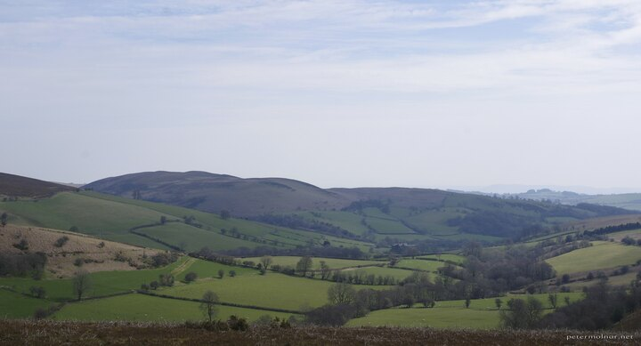

---
author:
    email: mail@petermolnar.net
    image: https://petermolnar.net/favicon.jpg
    name: Peter Molnar
    url: https://petermolnar.net
copies:
- https://www.flickr.com/photos/36003160@N08/51157244306
- http://web.archive.org/web/20210504114326/https://petermolnar.net/photo/red-hill-herefordshire/
published: '2021-05-04T09:00:00+01:00'
title: Red Hill in Herefordshire

---

While Nora went on a Japanese woodblock printing course in Herefordshire
I had two days to find something interesting around. I ended up pulling
up OsmAnd, looking for waterfalls; one of them was marked close to a
village called Painscastle.

Well, in the end I found the waterfall - a tiny, but very nice stream in
a creek in the middle of nowhere: bog & heather for miles and miles. The
photo above was towards one of the directions, the direction where there
was something.