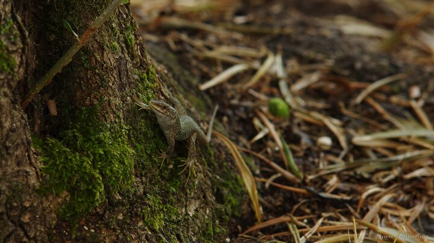

---
author:
    email: mail@petermolnar.net
    image: https://petermolnar.net/favicon.jpg
    name: Peter Molnar
    url: https://petermolnar.net
copies:
- http://web.archive.org/web/20190624130045/https://petermolnar.net/reptile/
- https://flickr.com/photos/petermolnareu/46618178341
published: '2019-01-05T18:00:00+00:00'
syndicate:
- https://brid.gy/publish/flickr
title: Reptile

---

This little fellow was staring at me after a rain at Sardinia, in a
small forest of olive trees, covering ancient ruins of disturbingly
sharply designed sacred wells[^1].

[^1]: <https://www.atlasobscura.com/places/well-of-santa-cristina>
