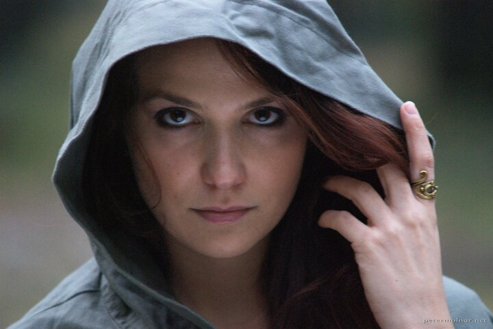

---
author:
    email: mail@petermolnar.net
    image: https://petermolnar.net/favicon.jpg
    name: Peter Molnar
    url: https://petermolnar.net
coordinates:
    latitude: 47.492819
    longitude: 19.093658
copies:
- https://www.flickr.com/photos/36003160@N08/14726621335
- http://web.archive.org/web/20190624130057/https://petermolnar.net/runaway-wanderer/
published: '2014-07-23T16:50:15+00:00'
syndicate:
- https://brid.gy/publish/flickr
tags:
- fantasy
- elf
- hood
- elven
- elvish
- runaway
title: Runaway - Wanderer

---

Part of a fantasy set based on the feeling of “runaway” at Hungarian
National Graveyard, Budapest, Hungary.

Model: Nora Hamucska