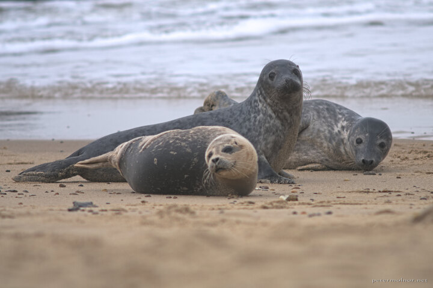

---
author:
    email: mail@petermolnar.net
    image: https://petermolnar.net/favicon.jpg
    name: Peter Molnar
    url: https://petermolnar.net
coordinates:
    latitude: 52.751541
    longitude: 1.66387
copies:
- https://www.flickr.com/photos/36003160@N08/14871280814
- http://web.archive.org/web/20140919110416/https://petermolnar.eu/photo/seals-in-norfolk-baby-seal-nursery/
published: '2014-08-10T06:25:16+00:00'
syndicate:
- https://brid.gy/publish/flickr
tags:
- England
- wild
- Norfolk
- United Kingdom
- seal
- baby seal
- sea
title: Seals in Norfolk - baby seal nursery

---

Beauty of Norfolk: when you can walk \~5 meters close to 3 baby seals
and take a picture like a boss.