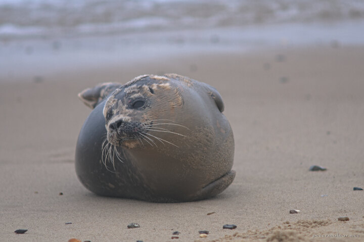

---
author:
    email: mail@petermolnar.net
    image: https://petermolnar.net/favicon.jpg
    name: Peter Molnar
    url: https://petermolnar.net
coordinates:
    latitude: 52.751541
    longitude: 1.66387
copies:
- https://www.flickr.com/photos/36003160@N08/14885005833
- http://web.archive.org/web/20190624130105/https://petermolnar.net/seals-in-norfolk-baby-seal/
published: '2014-08-09T06:28:00+00:00'
syndicate:
- https://brid.gy/publish/flickr
tags:
- England
- wild
- Norfolk
- United Kingdom
- seal
- baby seal
- sea
title: Seals in Norfolk - baby seal

---

There are some shores in Norfolk where you can literally walk right next
to the seals, all year long.

They are lovely creatures - as long as you keep your distance -,
especially the fat little babies, just lying, sleeping, playing around.