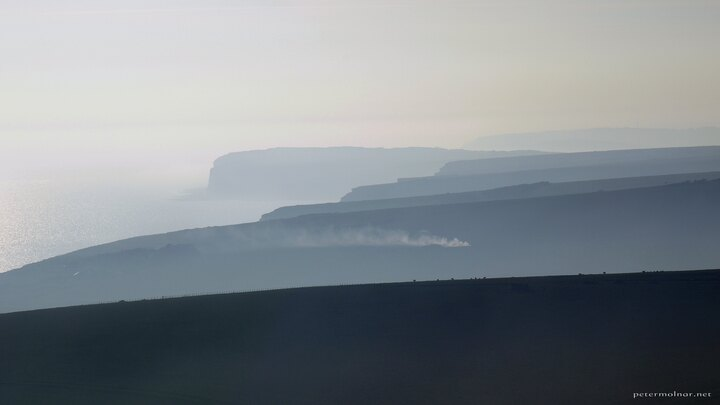

---
author:
    email: mail@petermolnar.net
    image: https://petermolnar.net/favicon.jpg
    name: Peter Molnar
    url: https://petermolnar.net
coordinates:
    latitude: 50.74555
    longitude: 0.237146
copies:
- https://www.flickr.com/photos/36003160@N08/17307758292
- http://web.archive.org/web/20150528120336/https://petermolnar.eu/photo/seven-sisters-from-beachy-head/
published: '2015-04-29T09:06:54+00:00'
syndicate:
- https://brid.gy/publish/flickr
tags:
- England
- English
- sunset
- shore
- Seven Sisters
- Beachy Head
- Eastbourne
title: Seven Sisters from Beachy Head

---

Beachy Head is one of the viewpoints you can see the Seven Sister from -
although you need some luck to capture all seven of the peaks in one
picture, which I lacked this time.