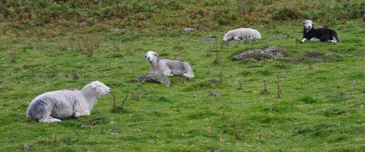

---
author:
    email: mail@petermolnar.net
    image: https://petermolnar.net/favicon.jpg
    name: Peter Molnar
    url: https://petermolnar.net
coordinates:
    latitude: 54.490931
    longitude: -3.036196
copies:
- https://www.flickr.com/photos/36003160@N08/23516179694
- http://web.archive.org/web/20190624130113/https://petermolnar.net/shades-of-herdwick/
published: '2016-01-03T10:07:06+00:00'
syndicate:
- https://brid.gy/publish/flickr
tags:
- sheep
- Herdwick
- silver
- Lake District
title: Shades of Herdwick

---

If you're not from England, you're not expecting to see a silver
coloured sheep. That is until you visit the marvellous Lake District and
encounter with your first Herdwick.