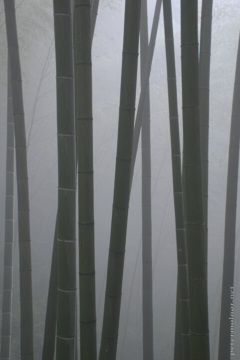

---
author:
    email: mail@petermolnar.net
    image: https://petermolnar.net/favicon.jpg
    name: Peter Molnar
    url: https://petermolnar.net
coordinates:
    latitude: 28.480762
    longitude: 104.984493
copies:
- https://www.flickr.com/photos/36003160@N08/15896199432
- http://web.archive.org/web/20141207171313/https://petermolnar.eu/photo/shunan-zuhai-bamboo-mist/
published: '2014-11-28T09:00:22+00:00'
syndicate:
- https://brid.gy/publish/flickr
tags:
- bamboo
- China
- Sichuan
- Shunan Bamboo Sea
- mist
title: Shunan Zuhai

---

For someone not speaking Chinese at all getting to Shunan Zhuhai, the
Bamboo Sea is not as easy as it seems, but due to the kind and helpful
locals, our visit turned out fantastic.

The Shunan Bamboo Sea (蜀南竹海国家公园) is a large, true bamboo forest:
trees are extremely rare here. Numerous movies were shot here, it's
filled with ancient, interesting places to see and is definitely
different from a normal, usual forest.