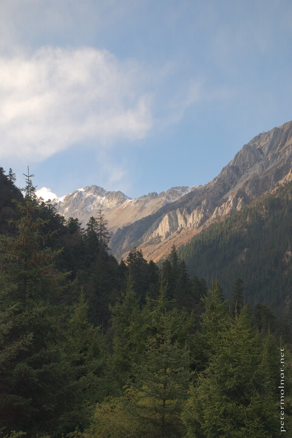

---
author:
    email: mail@petermolnar.net
    image: https://petermolnar.net/favicon.jpg
    name: Peter Molnar
    url: https://petermolnar.net
coordinates:
    latitude: 33.072124
    longitude: 103.858051
copies:
- https://www.flickr.com/photos/36003160@N08/15657072679
- http://web.archive.org/web/20141205234043/https://petermolnar.eu/photo/sichuan-mountains-jiuzhaigou-view/
published: '2014-10-26T09:03:28+00:00'
syndicate:
- https://brid.gy/publish/flickr
tags:
- Sichuan
- Primeval Forest
- autumn
- mountain
- Jiuzhaigou Valley
- China
title: Sichuan mountains - a view from Jiuzhaigou Primeval Forest

---

Scene from the Primeval Forest bus stop in Jiuzhaigou.

We had a very limited time at this point: it was getting late and we
both started to feel dizzy due to the rapid changes in the altitude -
the spot I've been standing at is at approximately 3000m.

It was unfortunate to underestimate the size of Jiuzhaigou; without the
buses, we could not have seem even one part of it, but this was, we were
able to get a glimpse of both paths.