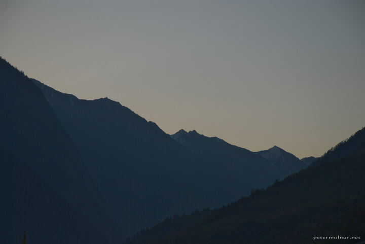

---
author:
    email: mail@petermolnar.net
    image: https://petermolnar.net/favicon.jpg
    name: Peter Molnar
    url: https://petermolnar.net
coordinates:
    latitude: 33.3090109999194
    longitude: 103.81462
copies:
- https://www.flickr.com/photos/36003160@N08/15825414935
- http://web.archive.org/web/20141205172102/https://petermolnar.eu/photo/sichuan-mountains-zanghzha-morning/
published: '2014-10-26T00:41:05+00:00'
syndicate:
- https://brid.gy/publish/flickr
tags:
- Sichuan
- dawn
- autumn
- mountain
- Jiuzhaigou Valley
- China
title: Morning veiw from a Jiuzhaigou accommodation

---

This is the view you get if you wake up early enough in the freezing
cold and walk out from your unheated room in Zanghzha, the city made for
tourists besides Jiuzhaigou valley.

(We did have heated bed, so sleeping was not an issue.)