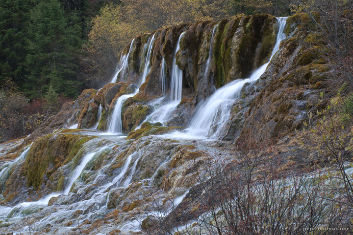

---
author:
    email: mail@petermolnar.net
    image: https://petermolnar.net/favicon.jpg
    name: Peter Molnar
    url: https://petermolnar.net
coordinates:
    latitude: 32.737255
    longitude: 103.823289
copies:
- https://www.flickr.com/photos/36003160@N08/15780384812
- http://web.archive.org/web/20141203143412/https://petermolnar.eu/photo/sichuan-waterfalls-marvelous-flying-waterfall/
published: '2014-11-13T09:00:18+00:00'
syndicate:
- https://brid.gy/publish/flickr
tags:
- Sichuan
- Huanglong
- autumn
- waterfall
- China
- Marvelous Flying Waterfall
title: Sichuan waterfalls - Marvelous Flying Waterfall

---

Huanglong Valley (黄龙沟) is a scenic area in Sichuan with countless,
bright blue and green ponds and astonishing waterfalls.

This is theMarvellous Flying Waterfall (飛瀑流輝) in autumn. It's
usually photographed from the other side, but I've found this
composition better.

We had a rough weather during our visit; fortunately no sleet or rain
was pouring at the moment we arrived here.