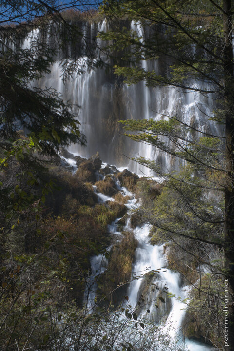

---
author:
    email: mail@petermolnar.net
    image: https://petermolnar.net/favicon.jpg
    name: Peter Molnar
    url: https://petermolnar.net
coordinates:
    latitude: 33.165073
    longitude: 103.906717
copies:
- https://www.flickr.com/photos/36003160@N08/15739890616
- http://web.archive.org/web/20190624130136/https://petermolnar.net/sichuan-waterfalls-nuorilang-waterfall-2/
published: '2014-10-26T04:37:54+00:00'
syndicate:
- https://brid.gy/publish/flickr
tags:
- Sichuan
- autumn
- Jiuzhaigou Valley
- waterfall
- China
- Nuorilang Waterfall
title: Nuorilang Waterfall (part)

---

Part of the magnificent Nuorilang Waterfall in Jiuzhaigou Valley
(九寨沟), Sichuan. The water drops from a lake, half covered with
plants, so it seems like falling out from the field itself. ..It's
nearly impossible to avoid the crowd, but during autumn, at the end of
October it's not entirely hopeless; just be patient.