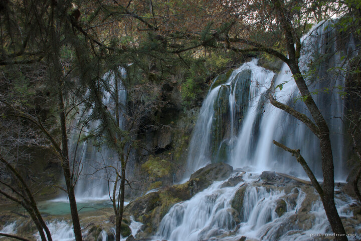

---
author:
    email: mail@petermolnar.net
    image: https://petermolnar.net/favicon.jpg
    name: Peter Molnar
    url: https://petermolnar.net
coordinates:
    latitude: 33.162343
    longitude: 103.881311
copies:
- https://www.flickr.com/photos/36003160@N08/15586717600
- http://web.archive.org/web/20141202083941/https://petermolnar.eu/photo/sichuan-waterfalls-panda-waterfall/
published: '2014-10-26T09:43:09+00:00'
syndicate:
- https://brid.gy/publish/flickr
tags:
- Sichuan
- autumn
- Panda Waterfall
- Jiuzhaigou Valley
- waterfall
- China
title: Panda Waterfalls, Jiuzhaigou

---

The Panda Waterfalls is the one falling from Panda Lake in Jiuzhaigou
Valley (九寨沟).

We had only one day in the park - where one could easily spend weeks -
and we wanted to visit both valleys accessible. Unfortunately we were in
a bit of a hurry by the we reached the Panda Lake since the last buses
were about to leave and we would have been looking at a \~20km walk back
to the entrance in case we miss them.

If you plan to visit this place, plan at least 2 days for it, but even
that is extremely brief.