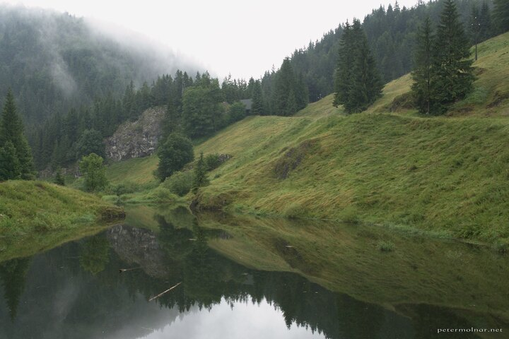

---
author:
    email: mail@petermolnar.net
    image: https://petermolnar.net/favicon.jpg
    name: Peter Molnar
    url: https://petermolnar.net
coordinates:
    latitude: 48.857832
    longitude: 20.37922
copies:
- https://www.flickr.com/photos/36003160@N08/14537035469
- http://web.archive.org/web/20190624130147/https://petermolnar.net/slovensky-raj-slovak-paradise-dedinky-lake-dobsinska-masa/
published: '2014-07-23T08:22:42+00:00'
syndicate:
- https://brid.gy/publish/flickr
tags:
- Dedinky
- Slovenský raj
- Dobšiná
- fog
- forest
- mist
- mountains
title: Slovenský raj - Dedinky Lake

---

The Slovak Paradise is a mountain area in Slovakia, Central Europe. We
visited it in the summer ( I know, the pictures look like it’s autumn )
and had some wonderful trip around.

We even found some bear footprints which is pretty frightening when the
two of you are alone on the woods, so be careful with hiking here :)