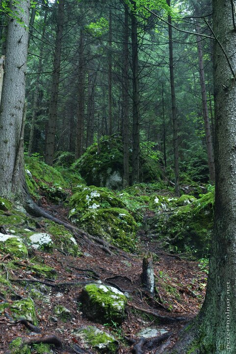

---
author:
    email: mail@petermolnar.net
    image: https://petermolnar.net/favicon.jpg
    name: Peter Molnar
    url: https://petermolnar.net
coordinates:
    latitude: 48.817178
    longitude: 20.3652189998806
copies:
- https://www.flickr.com/photos/36003160@N08/14721597244
- http://web.archive.org/web/20190624130148/https://petermolnar.net/slovensky-raj-slovak-paradise-forest-view/
published: '2014-07-23T09:29:04+00:00'
syndicate:
- https://brid.gy/publish/flickr
tags:
- mountains
- Slovenský raj
- forest
title: Slovenský raj - Forest view

---

This scenery is in the way from Stratená to Dobšiná, the Ice Cave, and
this was the exact location where we found some bear footprints on the
ground. I was pretty scared to stop taking pictures, but the view was
just too majestic to leave it behind without at least trying capturing
it.