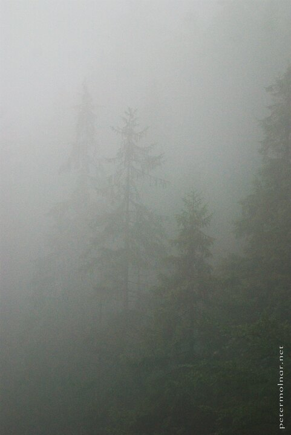

---
author:
    email: mail@petermolnar.net
    image: https://petermolnar.net/favicon.jpg
    name: Peter Molnar
    url: https://petermolnar.net
coordinates:
    latitude: 48.877558
    longitude: 20.3408429999278
copies:
- https://www.flickr.com/photos/36003160@N08/14537054619
- http://web.archive.org/web/20190624130149/https://petermolnar.net/slovensky-raj-slovak-paradise-mist-after-rain/
published: '2014-07-23T08:27:25+00:00'
syndicate:
- https://brid.gy/publish/flickr
tags:
- Slovenský raj
- fog
- forest
- mist
- rain
- mountains
title: Slovenský raj - Mist after rain

---

After we've experienced one of the heaviest rains I've ever seen the
firs slowly started to appear from the mist.

I had to ask Nora to hold my rain poncho over the camera and the tripod
while I took the picture, since the rain was still falling and the D80
is, unfortunately, no weather sealed enough for this.