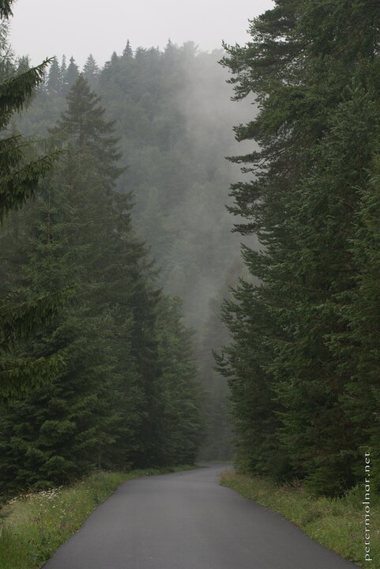

---
author:
    email: mail@petermolnar.net
    image: https://petermolnar.net/favicon.jpg
    name: Peter Molnar
    url: https://petermolnar.net
coordinates:
    latitude: 48.921455
    longitude: 20.306596
copies:
- https://www.flickr.com/photos/36003160@N08/14537453230
- http://web.archive.org/web/20190624130151/https://petermolnar.net/slovensky-raj-slovak-paradise-road-in-the-mountains/
published: '2014-07-23T09:59:39+00:00'
syndicate:
- https://brid.gy/publish/flickr
tags:
- Slovenský raj
- road
- forest
- fog
- mist
- mountains
- pine
title: Slovenský raj - Road in the mountains

---

Still in the Slovak Paradise we decided to have a bit more relaxed day (
most of our clothing needed to dry anyway ) and take a look at a small
town’s architecture. For that, we needed to cross the mountains on a
very, very winding very small road, which turned into one mass of fog
during the night, when we were coming back.