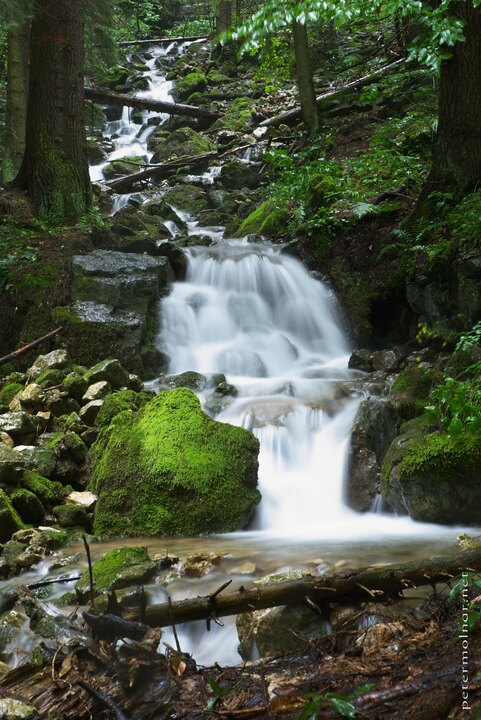

---
author:
    email: mail@petermolnar.net
    image: https://petermolnar.net/favicon.jpg
    name: Peter Molnar
    url: https://petermolnar.net
coordinates:
    latitude: 48.849919
    longitude: 20.3830710000889
copies:
- https://www.flickr.com/photos/36003160@N08/14723923445
- http://web.archive.org/web/20190624130152/https://petermolnar.net/slovensky-raj-slovak-paradise-waterfall/
published: '2014-07-23T09:17:02+00:00'
syndicate:
- https://brid.gy/publish/flickr
tags:
- Slovenský raj
- forest
- waterfall
- pine
title: Slovenský raj - Waterfall

---

Whenever I have the chance to visit a “proper” pine woodland I try to
find the small streams, hidden in the depth of the forest. It usually
involves getting off the trails ( although finding the trails in the
Slovak Paradise might be a problem in itself ), so take a compass and a
map with you ( preferably an army or a satellite map as well ) if you
plan to go deep.