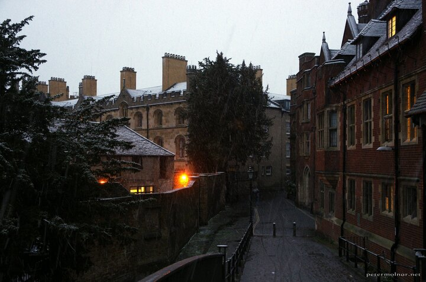

---
author:
    email: mail@petermolnar.net
    image: https://petermolnar.net/favicon.jpg
    name: Peter Molnar
    url: https://petermolnar.net
copies:
- http://web.archive.org/web/20210428114412/https://petermolnar.net/photo/snowfall-in-cambrdige/
- https://www.flickr.com/photos/36003160@N08/51145199850
published: '2021-04-28T09:00:00+01:00'
title: Snowfall in Cambridge

---

This is from last December, and I should have posted it for months now.
In Cambridge, snow, that actually stays visible is rare; rare enough
that with Nora, we usually get up for that one night when this tends to
happen - The Night of The Winter.

Well, this year, it lasted even shorter, but we still got a glimpse of a
morning snowfall. Probably the only good thing of the lockdowns were
that the city never got too busy with traffic, and a short walk in the
morning before work became possible.
