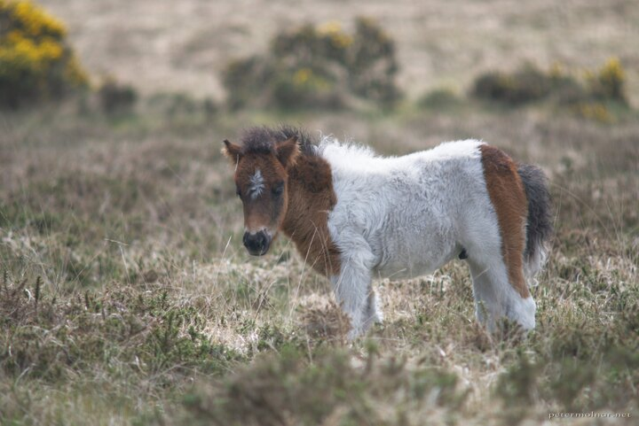

---
author:
    email: mail@petermolnar.net
    image: https://petermolnar.net/favicon.jpg
    name: Peter Molnar
    url: https://petermolnar.net
coordinates:
    latitude: 50.572771
    longitude: -3.949756
copies:
- https://www.flickr.com/photos/36003160@N08/14801053571
- http://web.archive.org/web/20190624130201/https://petermolnar.net/south-west-england-a-dartmoor-pony/
published: '2014-08-01T20:00:04+00:00'
syndicate:
- https://brid.gy/publish/flickr
tags:
- United Kingdom
- England
- Dartmoor
- pony
title: South-West England - a Dartmoor pony

---

Dartmoor[^1] is a strange place. It has a very disturbing, very dark
atmosphere while lovely little wild ponies roaming around on the fens.

[^1]: <https://en.wikipedia.org/wiki/Dartmoor>