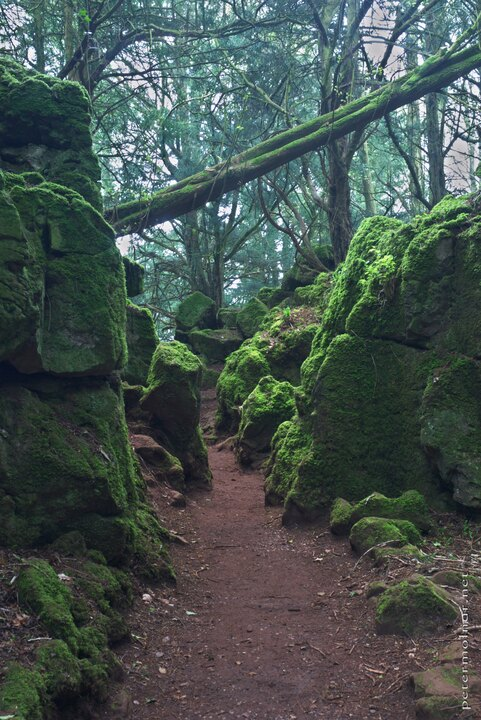

---
author:
    email: mail@petermolnar.net
    image: https://petermolnar.net/favicon.jpg
    name: Peter Molnar
    url: https://petermolnar.net
coordinates:
    latitude: 51.781189
    longitude: -2.611827
copies:
- https://www.flickr.com/photos/36003160@N08/14788741825
- http://web.archive.org/web/20190624130202/https://petermolnar.net/south-west-england-puzzlewood/
published: '2014-07-30T20:00:14+00:00'
syndicate:
- https://brid.gy/publish/flickr
tags:
- ancient forest
- England
- Forest of Dean
- Middle Earth
- Fangord
- forest
- United Kingdom
- Puzzlewood
title: South-West England - Puzzlewood

---

At the bottom of Wales where the border meets England, there is a large
forest - UK large, not Germany large - named Forest of Dean. Nearly in
the middle of it there is a small area, Puzzlewood, which preserves the
ancient times.

It is a small, maze-like area, where it's pretty easy to get lost. The
also made it very child-friendly, so it's a perfect time out with
family. They also shot numerous movies and series here, including a
Doctor Who episode with Weeping Angels.

J. R. R. Tolkien was a regular visitor here; some say that this was the
birthplace and the inspiration for Fangorn of Middle Earth.