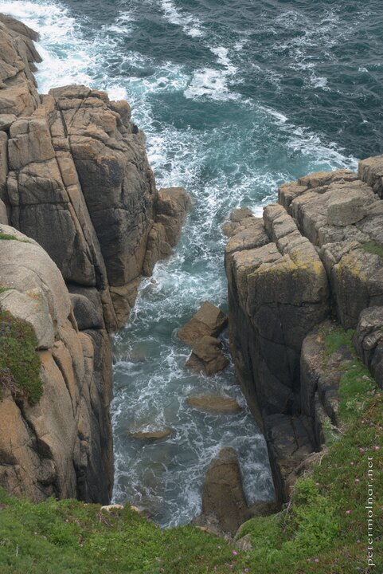

---
author:
    email: mail@petermolnar.net
    image: https://petermolnar.net/favicon.jpg
    name: Peter Molnar
    url: https://petermolnar.net
coordinates:
    latitude: 50.040494
    longitude: -5.651414
copies:
- https://www.flickr.com/photos/36003160@N08/14610105097
- http://web.archive.org/web/20190624130204/https://petermolnar.net/south-west-england-the-sea-behind-minack-theatre/
published: '2014-07-31T20:00:32+00:00'
syndicate:
- https://brid.gy/publish/flickr
tags:
- United Kingdom
- Minack Theatre
- South-West England
- sea
- rocks
title: South-West England - the sea behind Minack Theatre

---

The Minack Theatre[^1] is a surreal place: until you learn it's story
you're sure it's a leftover from the Greek times.

It's surrounded with Mediterranean plants, the sea is deep blue and
green. These are the cliffs right behind the stage.

[^1]: <http://www.minack.com/>