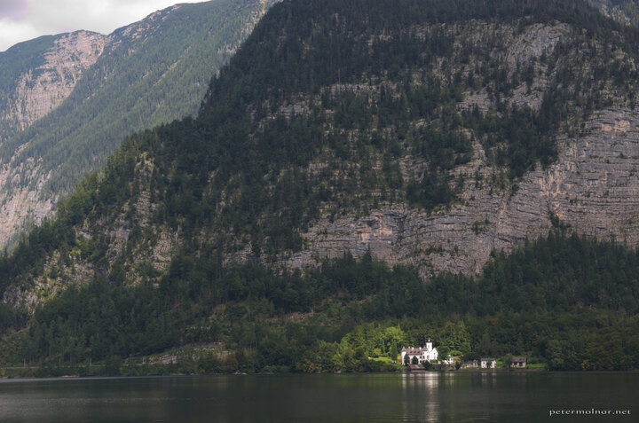

---
author:
    email: mail@petermolnar.net
    image: https://petermolnar.net/favicon.jpg
    name: Peter Molnar
    url: https://petermolnar.net
coordinates:
    latitude: 47.561642
    longitude: 13.649718
copies:
- https://www.flickr.com/photos/36003160@N08/21648088245
- http://web.archive.org/web/20190624130211/https://petermolnar.net/spotlight/
published: '2015-09-23T10:03:16+00:00'
syndicate:
- https://brid.gy/publish/flickr
tags:
- sunshine
- mountain
- lake
- focus
- Austria
- Hallstatt
- white
- spotlight
title: Spotlight

---

If you wait long enough in Hallstatt at the lake on a day with sunshine
and a few clouds, you'll end up with this view.