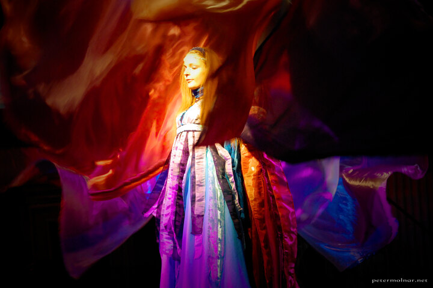

---
author:
    email: mail@petermolnar.net
    image: https://petermolnar.net/favicon.jpg
    name: Peter Molnar
    url: https://petermolnar.net
coordinates:
    latitude: 47.51503
    longitude: 19.081014
copies:
- https://www.flickr.com/photos/36003160@N08/15339692792
- http://web.archive.org/web/20141014204815/https://petermolnar.eu/photo/stage-twinkles-angel-of-mare-temporis/
published: '2014-09-24T10:00:01+00:00'
syndicate:
- https://brid.gy/publish/flickr
tags:
- dance
- angel
- show
- colours
- stage
- Mare Temporis
- angelwing
title: Stage Twinkles - An angel of Mare Temporis

---

Mare Temporis[^1] is a historical re-enacting group, focusing on
medieval Europe with some occasional additions. This scene was captured
at an event in February, held at an artificial ice-skating place to
celebrate the 500 year anniversary of crowning the famous Hungarian
king, King Matthias.

Taking pictures for hours in February after you've nearly broken you
wrist with a fall during ice-skating is a bit troublesome and painful, I
would not really recommend it :)

[^1]: <http://maretemporis.hu/>