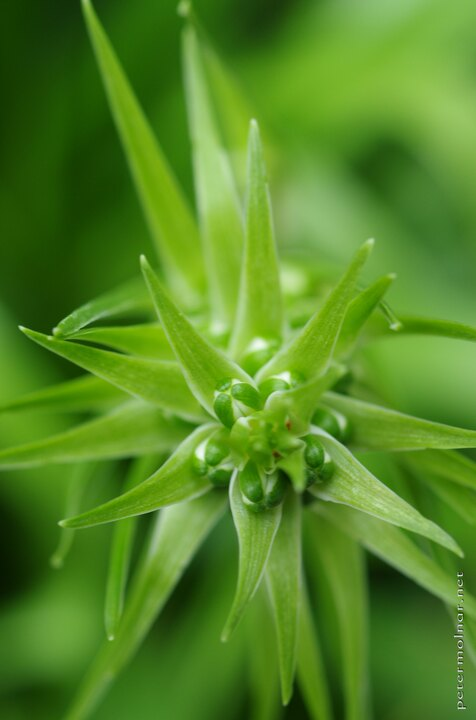

---
author:
    email: mail@petermolnar.net
    image: https://petermolnar.net/favicon.jpg
    name: Peter Molnar
    url: https://petermolnar.net
coordinates:
    latitude: 51.519643
    longitude: -0.0933089999305556
copies:
- https://www.flickr.com/photos/36003160@N08/17828355593
- http://web.archive.org/web/20190624130218/https://petermolnar.net/star/
published: '2015-06-04T08:49:20+00:00'
syndicate:
- https://brid.gy/publish/flickr
tags:
- flower
- closeup
- star
- macro
- Barbican
title: Star

---

Unfortunately I have no idea what species this plant is, but the shape
definitely caught my eye. It's living in the "Conservatory" of the
Barbican, which is not for music, but a place which looks like a
dystopian sci-fi where nature had took over the brutalist concrete
building.