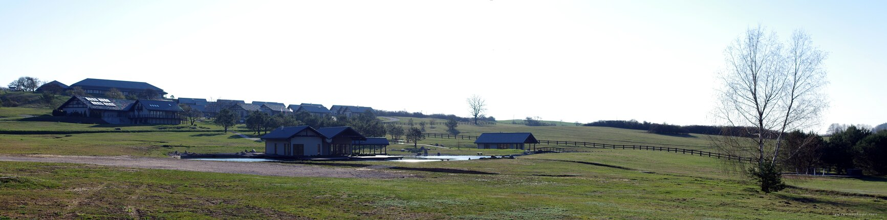

---
author:
    email: mail@petermolnar.net
    image: https://petermolnar.net/favicon.jpg
    name: Peter Molnar
    url: https://petermolnar.net
copies:
- https://www.flickr.com/photos/petermolnareu/47682495522/
- http://web.archive.org/web/20190624130219/https://petermolnar.net/stara-wies-dojo-panorama/
published: '2019-04-29T20:00:00+01:00'
syndicate:
- https://brid.gy/publish/flickr
tags:
- panorama
- outdoor
- spring
- Poland
- Japanese
- Dojo Stara Wieś
title: Panorama of Dojo Stara Wies

---

Before saying goodbye to Stara Wieś, I wanted to make an image of the
whole little village. This should have been made either earlier in the
morning, or much later, at sunset, but when you go there to train, one
can't simply run and leave the class to take a panorama; especially when
the classes are up in the big building on the left, at the top of the
hill.