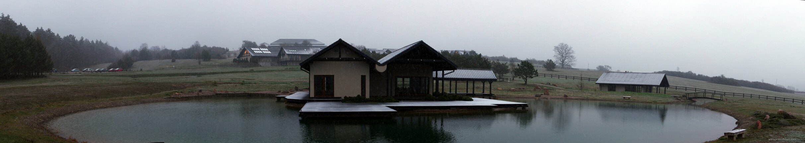

---
author:
    email: mail@petermolnar.net
    image: https://petermolnar.net/favicon.jpg
    name: Peter Molnar
    url: https://petermolnar.net
copies:
- https://www.flickr.com/photos/petermolnareu/40748712733/
- http://web.archive.org/web/20190624130222/https://petermolnar.net/stara-wies-dojo-snowy-panorama/
published: '2019-04-27T19:00:00+01:00'
syndicate:
- https://brid.gy/publish/flickr
tags:
- outdoor
- spring
- Poland
- Japanese
- Dojo Stara Wieś
- snow
- morning
title: Snowy panorama of Dojo Stara Wies

---

When you expect the same weather one year apart on the same spot in
Central Europe, it usually doesn't work. I deliberately got up 5am to
make use of the incredible water surfaces next to the houses at Dojo
Stara Wieś, only to realize that this time my companions are sleet,
cold, and grey misery.

The truth is, the place is still beautiful, even if you're shivering in
your bones.