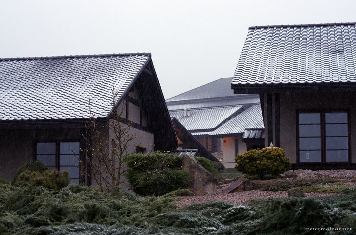

---
author:
    email: mail@petermolnar.net
    image: https://petermolnar.net/favicon.jpg
    name: Peter Molnar
    url: https://petermolnar.net
copies:
- https://www.flickr.com/photos/petermolnareu/33807712048/
- http://web.archive.org/web/20190624130225/https://petermolnar.net/stara-wies-dojo-snowy-rooftops/
published: '2019-04-23T21:00:00+00:00'
syndicate:
- https://brid.gy/publish/flickr
tags:
- outdoor
- spring
- Poland
- Japanese
- Dojo Stara Wieś
- snow
- morning
title: Snowy rooftops of the living accommodations at Dojo Stara Wies

---

A year later to our previous visit[^1] we repeated our Spring Retreat
with Pa-Kua[^2] to the magnificent dojo at Stara Wieś. On the contrary
to last year's glorious \~23°C, the first morning was gloomy, with sleet
and snow. At least it was different...

[^1]: <https://petermolnar.net/dawn-at-dojo-stara-wies/>

[^2]: <https://www.pakuauk.com/>