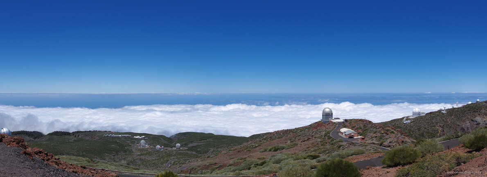

---
author:
    email: mail@petermolnar.net
    image: https://petermolnar.net/favicon.jpg
    name: Peter Molnar
    url: https://petermolnar.net
copies:
- https://www.flickr.com/photos/36003160@N08/41464407325
- http://web.archive.org/web/20190624130229/https://petermolnar.net/stargazers/
published: '2018-05-26T10:00:00+00:00'
syndicate:
- https://brid.gy/publish/flickr
tags:
- La Palma
- Canary Islands
- Roque de los Muchachos
- view
- panorama
- telescope
- astronomy
title: Stargazers

---

The Roque de los Muchachos host a significant amount and rather
important astronomy telescopes. Unfortunately visitors are not allowed
up here during the night because even that tiny ligth pollution could
distort measurements, but it's certainly a unique view, even during
daytime.